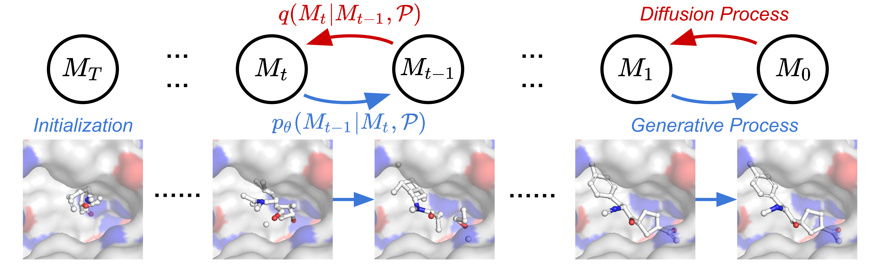

# 3D Equivariant Diffusion for Target-Aware Molecule Generation and Affinity Prediction

[](https://github.com/guanjq/targetdiff/blob/main/LICIENCE)


This repository is the official implementation of 3D Equivariant Diffusion for Target-Aware Molecule Generation and Affinity Prediction (ICLR 2023). [[PDF]](https://openreview.net/pdf?id=kJqXEPXMsE0) 

<p align="center">
   
</p>

## Installation

### Dependency

The code has been tested in the following environment:


| Package           | Version   |
|-------------------|-----------|
| Python            | 3.8       |
| PyTorch           | 1.13.1    |
| CUDA              | 11.6      |
| PyTorch Geometric | 2.2.0     |
| RDKit             | 2022.03.2 |

### Install via Conda and Pip
```bash
conda create -n targetdiff python=3.8
conda activate targetdiff
conda install pytorch pytorch-cuda=11.6 -c pytorch -c nvidia
conda install pyg -c pyg
conda install rdkit openbabel tensorboard pyyaml easydict python-lmdb -c conda-forge

# For Vina Docking
pip install meeko==0.1.dev3 scipy pdb2pqr vina==1.2.2 
python -m pip install git+https://github.com/Valdes-Tresanco-MS/AutoDockTools_py3
```
The code should work with PyTorch >= 1.9.0 and PyG >= 2.0. You can change the package version according to your need.

### (Alternatively) Install via Mamba
Install Mamba

```bash
wget "https://github.com/conda-forge/miniforge/releases/latest/download/Mambaforge-$(uname)-$(uname -m).sh"
bash Mambaforge-$(uname)-$(uname -m).sh  # accept all terms and install to the default location
rm Mambaforge-$(uname)-$(uname -m).sh  # (optionally) remove installer after using it
source ~/.bashrc  # alternatively, one can restart their shell session to achieve the same result
```

Create Mamba environment
```bash
mamba env create -f environment.yaml
conda activate targetdiff  # note: one still needs to use `conda` to (de)activate environments
```

-----
# Target-Aware Molecule Generation
## Data
The data used for training / evaluating the model are organized in the [data](https://drive.google.com/drive/folders/1j21cc7-97TedKh_El5E34yI8o5ckI7eK?usp=share_link) Google Drive folder.

To train the model from scratch, you need to download the preprocessed lmdb file and split file:
* `crossdocked_v1.1_rmsd1.0_pocket10_processed_final.lmdb`
* `crossdocked_pocket10_pose_split.pt`

To evaluate the model on the test set, you need to download _and_ unzip the `test_set.zip`. It includes the original PDB files that will be used in Vina Docking.

If you want to process the dataset from scratch, you need to download CrossDocked2020 v1.1 from [here](https://bits.csb.pitt.edu/files/crossdock2020/), save it into `data/CrossDocked2020`, and run the scripts in `scripts/data_preparation`:
* [clean_crossdocked.py](scripts/data_preparation/clean_crossdocked.py) will filter the original dataset and keep the ones with RMSD < 1A.
It will generate a `index.pkl` file and create a new directory containing the original filtered data (corresponds to `crossdocked_v1.1_rmsd1.0.tar.gz` in the drive). *You don't need these files if you have downloaded .lmdb file.*
    ```bash
    python scripts/data_preparation/clean_crossdocked.py --source data/CrossDocked2020 --dest data/crossdocked_v1.1_rmsd1.0 --rmsd_thr 1.0
    ```
* [extract_pockets.py](scripts/data_preparation/extract_pockets.py) will clip the original protein file to a 10A region around the binding molecule. E.g.
    ```bash
    python scripts/data_preparation/extract_pockets.py --source data/crossdocked_v1.1_rmsd1.0 --dest data/crossdocked_v1.1_rmsd1.0_pocket10
    ```
* [split_pl_dataset.py](scripts/data_preparation/split_pl_dataset.py) will split the training and test set. We use the same split `split_by_name.pt` as 
[AR](https://arxiv.org/abs/2203.10446) and [Pocket2Mol](https://arxiv.org/abs/2205.07249), which can also be downloaded in the Google Drive - data folder.
    ```bash
    python scripts/data_preparation/split_pl_dataset.py --path data/crossdocked_v1.1_rmsd1.0_pocket10 --dest data/crossdocked_pocket10_pose_split.pt --fixed_split data/split_by_name.pt
    ```
## Training
### Training from scratch
```bash
python scripts/train_diffusion.py configs/training.yml
```
### Trained model checkpoint
https://drive.google.com/drive/folders/1-ftaIrTXjWFhw3-0Twkrs5m0yX6CNarz?usp=share_link

## Sampling
### Sampling for pockets in the testset
```bash
python scripts/sample_diffusion.py configs/sampling.yml --data_id {i} # Replace {i} with the index of the data. i should be between 0 and 99 for the testset.
```
You can also speed up sampling with multiple GPUs, e.g.:
```bash
CUDA_VISIBLE_DEVICES=0 bash scripts/batch_sample_diffusion.sh configs/sampling.yml outputs 4 0 0
CUDA_VISIBLE_DEVICES=1 bash scripts/batch_sample_diffusion.sh configs/sampling.yml outputs 4 1 0
CUDA_VISIBLE_DEVICES=2 bash scripts/batch_sample_diffusion.sh configs/sampling.yml outputs 4 2 0
CUDA_VISIBLE_DEVICES=3 bash scripts/batch_sample_diffusion.sh configs/sampling.yml outputs 4 3 0
```

### Sampling from pdb file
To sample from a protein pocket (a 10A region around the reference ligand):
```bash
python scripts/sample_for_pocket.py configs/sampling.yml --pdb_path examples/1h36_A_rec_1h36_r88_lig_tt_docked_0_pocket10.pdb
```

## Evaluation
### Evaluation from sampling results
```bash
python scripts/evaluate_diffusion.py {OUTPUT_DIR} --docking_mode vina_score --protein_root data/test_set
```
The docking mode can be chosen from {qvina, vina_score, vina_dock, none}

Note: It will take some time to prepare pqdqt and pqr files when you run the evaluation code with vina_score/vina_dock docking mode for the first time.

### Evaluation from meta files
We provide the sampling results (also docked) of our model and CVAE, AR, Pocket2Mol baselines [here](https://drive.google.com/drive/folders/19imu-mlwrjnQhgbXpwsLgA17s1Rv70YS?usp=share_link).

| Metafile Name                   | Original Paper                                                                                      |
|---------------------------------|-----------------------------------------------------------------------------------------------------|
| crossdocked_test_vina_docked.pt | -                                                                                                   |
| cvae_vina_docked.pt             | [liGAN](https://arxiv.org/abs/2110.15200)                                                           |
| ar_vina_docked.pt               | [AR](https://proceedings.neurips.cc/paper/2021/hash/314450613369e0ee72d0da7f6fee773c-Abstract.html) |
| pocket2mol_vina_docked.pt       | [Pocket2Mol](https://proceedings.mlr.press/v162/peng22b.html)                                       |
| targetdiff_vina_docked.pt       | [TargetDiff](https://openreview.net/pdf?id=kJqXEPXMsE0)                                             |

You can directly evaluate from the meta file, e.g.:
```bash
python scripts/evaluate_from_meta.py sampling_results/targetdiff_vina_docked.pt --result_path eval_targetdiff
```

**One can reproduce the results reported in the paper quickly with [notebooks/summary.ipynb](notebooks/summary.ipynb)**

-----
# Binding Affinity Prediction

## Data
* In the unsupervised learning setting, we still use the CrossDocked2020 dataset and find the data with experimentally measured binding affinity (saved in `affinity_info.pkl`) for further analysis. 

* In the supervised learning setting, we use the PDBBind dataset, which can be downloaded from: http://www.pdbbind.org.cn. 
The downloaded refined / general set should be saved in data/pdbbind_v{YEAR} directory. 

Take the PDBBind v2016 for example, you need to first unzip the data:
```bash
mkdir -p data/pdbbind_v2016 && tar -xzvf data/pdbbind_v2016_refined.tar.gz -C data/pdbbind_v2016
```
Then, you can extract 10A pockets and split the dataset using the following commands:
```bash
# extract pockets
python scripts/property_prediction/extract_pockets.py --source data/pdbbind_v2016 --subset refined --refined_index_pkl data/pdbbind_v2016/pocket_10_refined/index.pkl

# split dataset
python scripts/property_prediction/pdbbind_split.py --index_path data/pdbbind_v2016/pocket_10_refined/index.pkl  --save_path data/pdbbind_v2016/pocket_10_refined/split.pt
```

## Training
One can train the binding affinity prediction model with:
```bash
python scripts/property_prediction/train_prop.py configs/prop/pdbbind_general_egnn.yml
```

It is also possible to enhance the model with extra features extracted from the unsupervised generative model. You need to first export the hidden states with:

```bash
python scripts/likelihood_est_diffusion_pdbbind.py
```

This command will dump various meta information and 
you need to specify the feature you want to use in the training config (like `configs/prop/pdbbind_general_egnn.yml`) of the following supervised prediction model.

### Trained model checkpoint
_NOTE: For the supervised learning setting, since the training results on PDBBind v2020 are lost by accident, 
we can only provide the model checkpoint trained on PDBBind v2016 in the preliminary experiments for now. 
However, it can already make accurate prediction for the practical use. 
We will retrain the models on PDBBind v2020 and provide the trained checkpoints as soon._

https://drive.google.com/drive/folders/1-ftaIrTXjWFhw3-0Twkrs5m0yX6CNarz?usp=share_link


## Evaluation
* For the unsupervised learning evaluation, please check [notebooks/analyze_affinity.ipynb](notebooks/analyze_affinity.ipynb)

* For the supervised learning evaluation, one can use the following command to evaluate on the tes set:
```bash
python scripts/property_prediction/eval_prop.py --ckpt_path pretrained_models/egnn_pdbbind_v2016.pt
```
Expected results:

| RMSE  | MAE   | R^2   | Pearson | Spearman |
|-------|-------|-------|---------|----------|
| 1.316 | 1.031 | 0.633 | 0.797   | 0.782    |


## Inference
To predict the binding affinity of a complex, one need to prepare the PDB file and SDF/MOL2 file first
(**Important: for the supervised learning model trained on PDBBind v2016, both protein and ligand need to have hydrogen atoms**). 
Then, the binding affinity can be predicted with [scripts/property_prediction/inference.py](scripts/property_prediction/inference.py). For example,
```bash
python scripts/property_prediction/inference.py \
  --ckpt_path pretrained_models/egnn_pdbbind_v2016.pt \
  --protein_path examples/3ug2_protein.pdb \
  --ligand_path examples/3ug2_ligand.sdf \
  --kind Kd
```

Expected prediction: Kd=5.23 nm.  Ground-truth: Kd=5.6 nm

## Citation
```
@inproceedings{guan3d,
  title={3D Equivariant Diffusion for Target-Aware Molecule Generation and Affinity Prediction},
  author={Guan, Jiaqi and Qian, Wesley Wei and Peng, Xingang and Su, Yufeng and Peng, Jian and Ma, Jianzhu},
  booktitle={International Conference on Learning Representations},
  year={2023}
}
```
